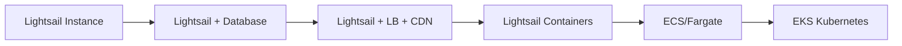

# RightLine MVP Deployment Guide

> **📦 Production deployment guide for RightLine MVP**  
> Lightweight, secure, and cost-effective deployment strategy optimized for Zimbabwe market.

## 🎯 Deployment Philosophy

Following our architecture principles:
- **Zero/Low Budget**: Start with $5-10/month VPS
- **Security First**: HTTPS, secrets management, rate limiting
- **Low Latency**: <2s response time on 2G/Edge networks
- **Simplicity**: Single server → Multi-server when needed
- **Observable**: Logging, monitoring, health checks from day one

---

## 📊 Deployment Platform: AWS Lightsail

**Selected Platform**: AWS Lightsail - Perfect balance of simplicity, cost-effectiveness, and AWS ecosystem integration.

### Why AWS Lightsail for RightLine MVP:
- **Predictable Pricing**: $5/month for 1GB RAM, 1 vCPU, 40GB SSD, 2TB transfer
- **AWS Integration**: Easy migration path to EC2/ECS/EKS when scaling
- **Global Regions**: Deploy close to Zimbabwe (Cape Town region available)
- **Built-in Features**: Load balancer, CDN, snapshots, DNS management
- **Free Tier**: First 3 months free on select plans
- **Managed Database**: Optional managed database instances
- **Container Support**: Native container deployment option

### Recommended Instances:
| Instance | RAM | vCPU | Storage | Transfer | Cost/Month | Use Case |
|----------|-----|------|---------|----------|------------|----------|
| **$5 Instance** | 1GB | 1 | 40GB SSD | 2TB | $5 | Development/Testing |
| **$10 Instance** | 2GB | 1 | 60GB SSD | 3TB | $10 | **MVP Production (Recommended)** |
| **$20 Instance** | 4GB | 2 | 80GB SSD | 4TB | $20 | Growth Phase |

---

## 🚀 Quick Start Deployment (15 minutes)

### Prerequisites

1. **AWS Account Setup**:
   - AWS Account with billing enabled
   - IAM user with Lightsail permissions (or use root account for MVP)
   - AWS CLI configured: `aws configure`

2. **Domain Name** (optional but recommended)
   - Register via Route 53 (~$12/year for .com)
   - Or use existing domain and point to Lightsail
   - Free option: Use Lightsail static IP directly

3. **Required Accounts**:
   ```
   ☐ AWS Account (for Lightsail)
   ☐ Meta Business Account (for WhatsApp Business API)
   ☐ Telegram BotFather (optional - for Telegram bot)
   ☐ Sentry.io (free tier - error tracking)
   ☐ CloudWatch (included with AWS - monitoring)
   ```

4. **Local Tools**:
   ```bash
   # Install AWS CLI
   brew install awscli
   
   # Install Lightsail CLI plugin
   brew install aws-lightsail
   
   # Install supporting tools
   brew install jq terraform
   
   # Configure AWS CLI
   aws configure
   # Enter your AWS Access Key ID, Secret Access Key, Region (af-south-1 for Cape Town)
   ```

---

## 📁 MVP Deployment Architecture on AWS Lightsail

```
┌─────────────────────────────────────────────┐
│         AWS CloudFront (Optional)           │
│         CDN + DDoS Protection                │
└────────────────┬────────────────────────────┘
                 │ HTTPS
                 ▼
┌─────────────────────────────────────────────┐
│      AWS Lightsail Instance ($10/month)     │
│         Ubuntu 22.04 LTS - 2GB RAM          │
│                                             │
│  ┌─────────────────────────────────────┐   │
│  │  Lightsail Load Balancer (Optional) │   │
│  │      SSL Certificate Manager         │   │
│  └────────────┬────────────────────────┘   │
│               │                             │
│  ┌────────────▼────────────────────────┐   │
│  │     Nginx (Reverse Proxy)           │   │
│  └────────────┬────────────────────────┘   │
│               │                             │
│  ┌────────────▼────────────────────────┐   │
│  │   Docker Compose Stack              │   │
│  │                                     │   │
│  │  ┌──────────────┐  ┌─────────────┐ │   │
│  │  │ FastAPI App  │  │    Redis    │ │   │
│  │  │   (Main)     │  │   (Cache)   │ │   │
│  │  └──────────────┘  └─────────────┘ │   │
│  │                                     │   │
│  │  ┌──────────────────────────────┐  │   │
│  │  │   SQLite (Embedded DB)       │  │   │
│  │  │   /data/rightline.db         │  │   │
│  │  └──────────────────────────────┘  │   │
│  └─────────────────────────────────────┘   │
│                                             │
│  ┌─────────────────────────────────────┐   │
│  │   AWS CloudWatch (Monitoring)       │   │
│  │   Automatic Snapshots (Backup)      │   │
│  └─────────────────────────────────────┘   │
└─────────────────────────────────────────────┘

Future Scaling Path:
- Lightsail Database (Managed PostgreSQL)
- Lightsail Container Service
- Easy migration to ECS/Fargate
```

---

## 🔧 Step-by-Step Deployment

### Step 1: Create AWS Lightsail Instance

```bash
# Set variables
INSTANCE_NAME="rightline-mvp"
REGION="af-south-1"  # Cape Town (closest to Zimbabwe)
# Alternative regions: eu-west-1 (Ireland), us-east-1 (Virginia)

# Create SSH key pair (if not exists)
aws lightsail create-key-pair \
  --key-pair-name rightline-key \
  --region $REGION \
  --query 'privateKeyBase64' \
  --output text | base64 --decode > ~/.ssh/rightline-key.pem
chmod 600 ~/.ssh/rightline-key.pem

# Create Lightsail instance
aws lightsail create-instances \
  --instance-names $INSTANCE_NAME \
  --availability-zone ${REGION}a \
  --blueprint-id ubuntu_22_04 \
  --bundle-id small_2_0 \
  --key-pair-name rightline-key \
  --region $REGION \
  --user-data file://scripts/lightsail-userdata.sh

# Wait for instance to be running
echo "Waiting for instance to start..."
aws lightsail wait instance-running --instance-name $INSTANCE_NAME --region $REGION

# Allocate static IP
aws lightsail allocate-static-ip \
  --static-ip-name rightline-ip \
  --region $REGION

# Attach static IP to instance
aws lightsail attach-static-ip \
  --static-ip-name rightline-ip \
  --instance-name $INSTANCE_NAME \
  --region $REGION

# Get the static IP
export SERVER_IP=$(aws lightsail get-static-ip \
  --static-ip-name rightline-ip \
  --region $REGION \
  --query 'staticIp.ipAddress' \
  --output text)

echo "Instance created with IP: $SERVER_IP"

# Open required ports
aws lightsail put-instance-public-ports \
  --instance-name $INSTANCE_NAME \
  --region $REGION \
  --port-infos \
    protocol=tcp,fromPort=22,toPort=22 \
    protocol=tcp,fromPort=80,toPort=80 \
    protocol=tcp,fromPort=443,toPort=443
```

### Step 2: Initial Server Setup

Create setup script `scripts/setup-server.sh`:

```bash
#!/bin/bash
# Server initialization script

set -euo pipefail

# Update system
apt-get update && apt-get upgrade -y

# Install essentials
apt-get install -y \
  curl \
  wget \
  git \
  vim \
  htop \
  ufw \
  fail2ban \
  unattended-upgrades

# Setup firewall
ufw default deny incoming
ufw default allow outgoing
ufw allow ssh
ufw allow http
ufw allow https
ufw --force enable

# Install Docker
curl -fsSL https://get.docker.com | sh
systemctl enable docker
systemctl start docker

# Install Docker Compose
curl -L "https://github.com/docker/compose/releases/latest/download/docker-compose-$(uname -s)-$(uname -m)" -o /usr/local/bin/docker-compose
chmod +x /usr/local/bin/docker-compose

# Create app user
useradd -m -s /bin/bash rightline
usermod -aG docker rightline

# Setup directories
mkdir -p /opt/rightline/{data,logs,backups,configs}
chown -R rightline:rightline /opt/rightline

# Setup swap (for low memory VPS)
fallocate -l 2G /swapfile
chmod 600 /swapfile
mkswap /swapfile
swapon /swapfile
echo '/swapfile none swap sw 0 0' >> /etc/fstab

# Configure sysctl for production
cat >> /etc/sysctl.conf <<EOF
# Network optimizations
net.core.somaxconn = 65535
net.ipv4.tcp_max_syn_backlog = 8192
net.ipv4.tcp_tw_reuse = 1
net.ipv4.ip_local_port_range = 10000 65000

# Memory optimizations
vm.swappiness = 10
vm.dirty_ratio = 15
vm.dirty_background_ratio = 5
EOF
sysctl -p

echo "Server setup complete!"
```

Run setup:
```bash
# Copy and run setup script
scp scripts/setup-server.sh root@$SERVER_IP:/tmp/
ssh root@$SERVER_IP "bash /tmp/setup-server.sh"
```

### Step 3: Deploy Application

Create `docker-compose.mvp.yml`:

```yaml
version: '3.8'

services:
  api:
    image: rightline/api:mvp
    container_name: rightline-api
    restart: always
    ports:
      - "127.0.0.1:8000:8000"
    environment:
      # Core settings
      RIGHTLINE_APP_NAME: "RightLine"
      RIGHTLINE_APP_ENV: "production"
      RIGHTLINE_DEBUG: "false"
      RIGHTLINE_LOG_LEVEL: "INFO"
      
      # Security
      RIGHTLINE_SECRET_KEY: "${SECRET_KEY}"
      RIGHTLINE_ALLOWED_HOSTS: "${DOMAIN},localhost"
      RIGHTLINE_CORS_ORIGINS: "https://${DOMAIN}"
      
      # Database (SQLite for MVP)
      RIGHTLINE_DATABASE_URL: "sqlite:////data/rightline.db"
      
      # Redis cache
      RIGHTLINE_REDIS_URL: "redis://redis:6379/0"
      
      # WhatsApp
      RIGHTLINE_WHATSAPP_WEBHOOK_URL: "https://${DOMAIN}/webhook"
      RIGHTLINE_WHATSAPP_VERIFY_TOKEN: "${WHATSAPP_VERIFY_TOKEN}"
      RIGHTLINE_WHATSAPP_ACCESS_TOKEN: "${WHATSAPP_ACCESS_TOKEN}"
      
      # Rate limiting
      RIGHTLINE_RATE_LIMIT_ENABLED: "true"
      RIGHTLINE_RATE_LIMIT_PER_MINUTE: "60"
      
      # Monitoring
      RIGHTLINE_SENTRY_DSN: "${SENTRY_DSN}"
      RIGHTLINE_METRICS_ENABLED: "true"
    volumes:
      - ./data:/data
      - ./logs:/logs
    healthcheck:
      test: ["CMD", "curl", "-f", "http://localhost:8000/healthz"]
      interval: 30s
      timeout: 10s
      retries: 3
      start_period: 40s
    depends_on:
      - redis
    networks:
      - rightline

  redis:
    image: redis:7-alpine
    container_name: rightline-redis
    restart: always
    command: redis-server --appendonly yes --maxmemory 256mb --maxmemory-policy allkeys-lru
    volumes:
      - redis-data:/data
    healthcheck:
      test: ["CMD", "redis-cli", "ping"]
      interval: 30s
      timeout: 10s
      retries: 3
    networks:
      - rightline

  nginx:
    image: nginx:alpine
    container_name: rightline-nginx
    restart: always
    ports:
      - "80:80"
      - "443:443"
    volumes:
      - ./nginx/nginx.conf:/etc/nginx/nginx.conf:ro
      - ./nginx/sites:/etc/nginx/sites-enabled:ro
      - ./ssl:/etc/nginx/ssl:ro
      - ./static:/usr/share/nginx/html/static:ro
    depends_on:
      - api
    networks:
      - rightline

networks:
  rightline:
    driver: bridge

volumes:
  redis-data:
```

### Step 4: Nginx Configuration

Create `nginx/sites/rightline.conf`:

```nginx
# Rate limiting zones
limit_req_zone $binary_remote_addr zone=api:10m rate=10r/s;
limit_req_zone $binary_remote_addr zone=webhook:10m rate=30r/s;

# Upstream
upstream rightline_api {
    server api:8000;
    keepalive 32;
}

server {
    listen 80;
    server_name _;
    return 301 https://$host$request_uri;
}

server {
    listen 443 ssl http2;
    server_name ${DOMAIN};

    # SSL Configuration
    ssl_certificate /etc/nginx/ssl/cert.pem;
    ssl_certificate_key /etc/nginx/ssl/key.pem;
    ssl_protocols TLSv1.2 TLSv1.3;
    ssl_ciphers HIGH:!aNULL:!MD5;
    ssl_prefer_server_ciphers on;
    ssl_session_cache shared:SSL:10m;
    ssl_session_timeout 10m;

    # Security headers
    add_header X-Frame-Options "SAMEORIGIN" always;
    add_header X-Content-Type-Options "nosniff" always;
    add_header X-XSS-Protection "1; mode=block" always;
    add_header Strict-Transport-Security "max-age=31536000; includeSubDomains" always;

    # Gzip
    gzip on;
    gzip_vary on;
    gzip_types text/plain text/css application/json application/javascript text/xml application/xml application/xml+rss text/javascript;

    # Static files
    location /static {
        alias /usr/share/nginx/html/static;
        expires 7d;
        add_header Cache-Control "public, immutable";
    }

    # Health checks (no rate limit)
    location ~ ^/(healthz|readyz)$ {
        proxy_pass http://rightline_api;
        proxy_set_header Host $host;
        access_log off;
    }

    # WhatsApp webhook
    location /webhook {
        limit_req zone=webhook burst=10 nodelay;
        
        proxy_pass http://rightline_api;
        proxy_set_header Host $host;
        proxy_set_header X-Real-IP $remote_addr;
        proxy_set_header X-Forwarded-For $proxy_add_x_forwarded_for;
        proxy_set_header X-Forwarded-Proto $scheme;
        
        # WhatsApp specific
        proxy_read_timeout 15s;
        proxy_connect_timeout 5s;
    }

    # API endpoints
    location / {
        limit_req zone=api burst=5 nodelay;
        
        proxy_pass http://rightline_api;
        proxy_set_header Host $host;
        proxy_set_header X-Real-IP $remote_addr;
        proxy_set_header X-Forwarded-For $proxy_add_x_forwarded_for;
        proxy_set_header X-Forwarded-Proto $scheme;
        
        # Timeouts
        proxy_read_timeout 10s;
        proxy_connect_timeout 5s;
        proxy_send_timeout 10s;
        
        # Buffering
        proxy_buffering on;
        proxy_buffer_size 4k;
        proxy_buffers 8 4k;
    }

    # Custom error pages
    error_page 502 503 504 /50x.html;
    location = /50x.html {
        root /usr/share/nginx/html;
    }
}
```

### Step 5: Environment Configuration

Create `.env.production`:

```bash
# Domain
DOMAIN=rightline.co.zw

# Security
SECRET_KEY=your-very-long-random-secret-key-at-least-32-chars

# WhatsApp Business API
WHATSAPP_VERIFY_TOKEN=your-webhook-verify-token
WHATSAPP_ACCESS_TOKEN=your-whatsapp-access-token
WHATSAPP_PHONE_NUMBER_ID=your-phone-number-id

# Telegram (optional)
TELEGRAM_BOT_TOKEN=your-telegram-bot-token

# Monitoring
SENTRY_DSN=https://xxx@sentry.io/yyy

# Database backups
BACKUP_ENCRYPTION_KEY=your-backup-encryption-key
```

### Step 6: Deployment Script

Create `scripts/deploy.sh`:

```bash
#!/bin/bash
# Deployment script for RightLine MVP

set -euo pipefail

# Configuration
REMOTE_USER="rightline"
REMOTE_HOST="${1:-}"
REMOTE_DIR="/opt/rightline"

if [ -z "$REMOTE_HOST" ]; then
    echo "Usage: $0 <server-ip-or-domain>"
    exit 1
fi

echo "🚀 Deploying RightLine to $REMOTE_HOST..."

# Build Docker image
echo "📦 Building Docker image..."
docker build -t rightline/api:mvp -f services/api/Dockerfile .

# Save and compress image
echo "💾 Saving Docker image..."
docker save rightline/api:mvp | gzip > rightline-mvp.tar.gz

# Upload files
echo "📤 Uploading files..."
rsync -avz --progress \
    rightline-mvp.tar.gz \
    docker-compose.mvp.yml \
    nginx/ \
    scripts/ \
    .env.production \
    $REMOTE_USER@$REMOTE_HOST:$REMOTE_DIR/

# Deploy on server
echo "🔧 Deploying on server..."
ssh $REMOTE_USER@$REMOTE_HOST << 'ENDSSH'
cd /opt/rightline

# Load Docker image
echo "Loading Docker image..."
docker load < rightline-mvp.tar.gz

# Stop existing services
docker-compose -f docker-compose.mvp.yml down || true

# Start services
echo "Starting services..."
docker-compose -f docker-compose.mvp.yml up -d

# Wait for health check
echo "Waiting for services to be healthy..."
sleep 10
docker-compose -f docker-compose.mvp.yml ps

# Run database migrations (if any)
docker-compose -f docker-compose.mvp.yml exec -T api python -m alembic upgrade head || true

# Verify deployment
curl -f http://localhost:8000/healthz || exit 1

echo "✅ Deployment successful!"
ENDSSH

# Cleanup
rm rightline-mvp.tar.gz

echo "🎉 Deployment complete! Check https://$REMOTE_HOST"
```

---

## 🔒 Security Checklist

```
☐ Enable UFW firewall
☐ Configure fail2ban
☐ Setup SSL certificates (Let's Encrypt)
☐ Rotate all default passwords
☐ Enable automatic security updates
☐ Configure backup strategy
☐ Setup log rotation
☐ Implement rate limiting
☐ Enable CORS properly
☐ Secure environment variables
☐ Setup monitoring alerts
☐ Configure DDoS protection (Cloudflare)
```

---

## 📊 Monitoring Setup with AWS

### 1. CloudWatch Integration

Lightsail automatically sends metrics to CloudWatch:

```bash
# View instance metrics
aws cloudwatch get-metric-statistics \
  --namespace AWS/Lightsail \
  --metric-name CPUUtilization \
  --dimensions Name=InstanceName,Value=rightline-mvp \
  --start-time $(date -u -d '1 hour ago' +%Y-%m-%dT%H:%M:%S) \
  --end-time $(date -u +%Y-%m-%dT%H:%M:%S) \
  --period 300 \
  --statistics Average \
  --region af-south-1
```

### 2. Application Monitoring

```bash
# Install CloudWatch agent on instance
ssh ubuntu@$INSTANCE_IP << 'EOF'
wget https://s3.amazonaws.com/amazoncloudwatch-agent/ubuntu/amd64/latest/amazon-cloudwatch-agent.deb
sudo dpkg -i amazon-cloudwatch-agent.deb
sudo /opt/aws/amazon-cloudwatch-agent/bin/amazon-cloudwatch-agent-config-wizard
EOF
```

### 3. Custom Metrics

Add custom metrics from your application:

```python
# In your FastAPI app
import boto3
cloudwatch = boto3.client('cloudwatch', region_name='af-south-1')

# Send custom metric
cloudwatch.put_metric_data(
    Namespace='RightLine',
    MetricData=[
        {
            'MetricName': 'QueryResponseTime',
            'Value': response_time_ms,
            'Unit': 'Milliseconds'
        }
    ]
)
```

### 4. Alarms and Notifications

```bash
# Create SNS topic for alerts
aws sns create-topic --name rightline-alerts --region af-south-1

# Subscribe email
aws sns subscribe \
  --topic-arn arn:aws:sns:af-south-1:YOUR_ACCOUNT:rightline-alerts \
  --protocol email \
  --notification-endpoint your-email@example.com

# Create alarm
aws cloudwatch put-metric-alarm \
  --alarm-name rightline-high-cpu \
  --alarm-description "Alert when CPU exceeds 80%" \
  --metric-name CPUUtilization \
  --namespace AWS/Lightsail \
  --statistic Average \
  --period 300 \
  --threshold 80 \
  --comparison-operator GreaterThanThreshold \
  --dimensions Name=InstanceName,Value=rightline-mvp \
  --evaluation-periods 2 \
  --alarm-actions arn:aws:sns:af-south-1:YOUR_ACCOUNT:rightline-alerts
```

### 5. Log Aggregation with CloudWatch Logs

```bash
# Configure Docker to send logs to CloudWatch
cat > /opt/rightline/docker-compose.override.yml << 'EOF'
version: '3.8'
services:
  api:
    logging:
      driver: awslogs
      options:
        awslogs-group: /aws/lightsail/rightline
        awslogs-region: af-south-1
        awslogs-stream-prefix: api
EOF
```

---

## 🔄 Backup Strategy with AWS

### 1. Automatic Lightsail Snapshots

```bash
# Enable automatic snapshots (7-day retention)
aws lightsail enable-add-on \
  --resource-name rightline-mvp \
  --add-on-request addOnType=AutoSnapshot \
  --region af-south-1

# Create manual snapshot
aws lightsail create-instance-snapshot \
  --instance-name rightline-mvp \
  --instance-snapshot-name "manual-$(date +%Y%m%d-%H%M%S)" \
  --region af-south-1
```

### 2. Application Data Backup to S3

Create `scripts/backup-to-s3.sh`:

```bash
#!/bin/bash
# Backup RightLine data to S3

BACKUP_BUCKET="rightline-backups"
TIMESTAMP=$(date +%Y%m%d_%H%M%S)
BACKUP_FILE="rightline_backup_${TIMESTAMP}.tar.gz"
REGION="af-south-1"

# Create S3 bucket if not exists
aws s3api create-bucket \
  --bucket $BACKUP_BUCKET \
  --region $REGION \
  --create-bucket-configuration LocationConstraint=$REGION 2>/dev/null || true

# Enable versioning on bucket
aws s3api put-bucket-versioning \
  --bucket $BACKUP_BUCKET \
  --versioning-configuration Status=Enabled

# Create backup
cd /opt/rightline
tar -czf "/tmp/${BACKUP_FILE}" \
    data/ \
    .env \
    docker-compose.mvp.yml \
    nginx/

# Upload to S3 with encryption
aws s3 cp "/tmp/${BACKUP_FILE}" \
  "s3://${BACKUP_BUCKET}/daily/" \
  --storage-class STANDARD_IA \
  --server-side-encryption AES256

# Clean up local file
rm "/tmp/${BACKUP_FILE}"

# Delete backups older than 30 days
aws s3api list-objects-v2 \
  --bucket $BACKUP_BUCKET \
  --prefix daily/ \
  --query "Contents[?LastModified<='$(date -d '30 days ago' --iso-8601)'].Key" \
  --output text | xargs -I {} aws s3 rm "s3://${BACKUP_BUCKET}/{}"

echo "Backup uploaded to S3: s3://${BACKUP_BUCKET}/daily/${BACKUP_FILE}"
```

### 3. Database Export (when using Lightsail Database)

```bash
# Export database snapshot
aws lightsail export-snapshot \
  --source-snapshot-name rightline-db-snapshot \
  --region af-south-1

# Download backup locally
aws s3 cp s3://aws-lightsail-exports/rightline-db-export.sql ./
```

### 4. Disaster Recovery Plan

```bash
# Restore from Lightsail snapshot
aws lightsail create-instances-from-snapshot \
  --instance-names rightline-restored \
  --availability-zone af-south-1a \
  --instance-snapshot-name manual-20250110 \
  --bundle-id small_2_0

# Restore from S3 backup
aws s3 cp s3://rightline-backups/daily/rightline_backup_latest.tar.gz ./
tar -xzf rightline_backup_latest.tar.gz -C /opt/rightline/
```

Add to crontab:
```bash
# Daily backup to S3 at 2 AM
0 2 * * * /opt/rightline/scripts/backup-to-s3.sh >> /opt/rightline/logs/backup.log 2>&1
```

---

## 🚨 Rollback Procedure

If deployment fails:

```bash
# Quick rollback
ssh rightline@your-server << 'ENDSSH'
cd /opt/rightline

# Restore previous version
docker-compose -f docker-compose.mvp.yml down
docker load < rightline-mvp-previous.tar.gz
docker-compose -f docker-compose.mvp.yml up -d

# Verify
curl -f http://localhost:8000/healthz
ENDSSH
```

---

## 📈 AWS Lightsail Scaling Path

### Phase 1: Single Instance (Current MVP)
- 1 Lightsail Instance: API + Redis + SQLite
- Instance: $10/month (2GB RAM)
- Handles: ~100 concurrent users
- **Total Cost: $10-12/month**

### Phase 2: Database Separation
- Lightsail Instance: API + Redis ($10)
- Lightsail Database: Managed PostgreSQL ($15)
- Handles: ~500 concurrent users
- **Total Cost: $25-30/month**

### Phase 3: Load Balanced with CDN
- 2x Lightsail Instances: API ($20)
- Lightsail Load Balancer: ($18)
- Lightsail Database: PostgreSQL ($15)
- CloudFront CDN: (~$10)
- Handles: ~2000 concurrent users
- **Total Cost: $63-70/month**

### Phase 4: Container Service
- Lightsail Container Service: 2 nodes ($40)
- Lightsail Database: PostgreSQL High Availability ($30)
- CloudFront CDN: ($10-20)
- Handles: ~5000 concurrent users
- **Total Cost: $80-90/month**

### Phase 5: Migration to AWS ECS/Fargate
- ECS Fargate: Auto-scaling containers
- RDS PostgreSQL: Multi-AZ deployment
- ElastiCache Redis: Managed Redis
- Application Load Balancer
- CloudFront CDN
- Handles: 10,000+ concurrent users
- **Total Cost: $200-500/month** (usage-based)

### AWS Service Migration Path



---

## 🔧 Troubleshooting

### Common Issues

1. **Port 8000 already in use**
   ```bash
   sudo lsof -i :8000
   sudo kill -9 <PID>
   ```

2. **Docker permission denied**
   ```bash
   sudo usermod -aG docker $USER
   newgrp docker
   ```

3. **SSL certificate issues**
   ```bash
   # Use Let's Encrypt
   sudo certbot --nginx -d your-domain.com
   ```

4. **High memory usage**
   ```bash
   # Adjust Redis memory
   docker exec rightline-redis redis-cli CONFIG SET maxmemory 128mb
   ```

5. **Slow responses**
   - Check Redis cache hit rate
   - Enable query result caching
   - Optimize SQLite queries
   - Consider upgrading VPS

---

## 📝 Post-Deployment Checklist

```
☐ Verify all endpoints working
☐ Test WhatsApp webhook
☐ Check SSL certificate
☐ Verify rate limiting
☐ Test error pages
☐ Check logs for errors
☐ Verify backups running
☐ Setup monitoring alerts
☐ Document API endpoints
☐ Share access credentials securely
```

---

## 🎯 Next Steps

1. **Immediate (Day 1)**:
   - Deploy to staging environment
   - Test with real WhatsApp Business API
   - Setup monitoring

2. **Week 1**:
   - Gather user feedback
   - Monitor performance metrics
   - Optimize slow queries

3. **Month 1**:
   - Analyze usage patterns
   - Plan scaling strategy
   - Implement missing features

---

## 📚 Additional Resources

- [FastAPI Deployment](https://fastapi.tiangolo.com/deployment/)
- [Docker Best Practices](https://docs.docker.com/develop/dev-best-practices/)
- [Nginx Optimization](https://www.nginx.com/blog/tuning-nginx/)
- [Ubuntu Security Guide](https://ubuntu.com/security/certifications/docs/2004)
- [WhatsApp Business API](https://developers.facebook.com/docs/whatsapp/cloud-api)

---

*Last updated: 2025-01-10*
*Version: 1.0.0*
